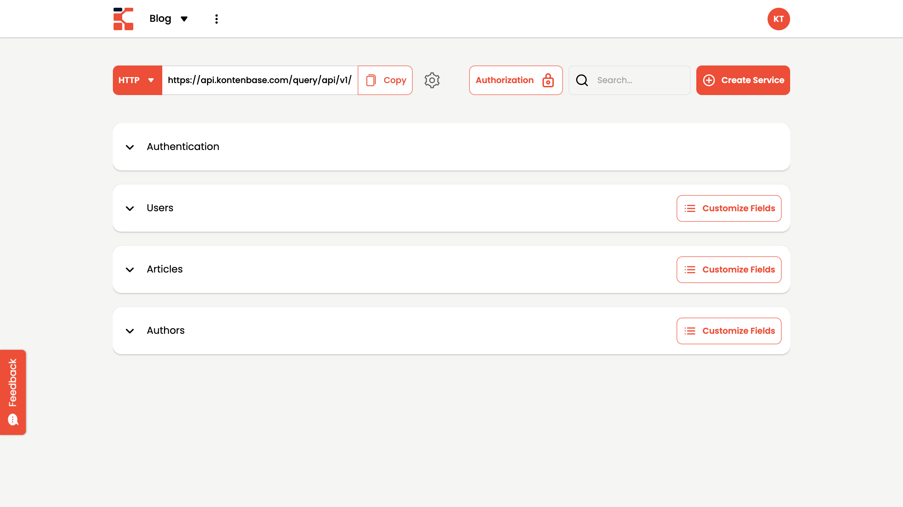

# Blog

Let's create a Blog project with Kontenbase.

## Expected results

Here are the expected results:

## Services or REST API Endpoints

There will be some services with their REST API endpoints or functionalities:

Authentication, Users, Articles, and Authors

- Authentication
  - Register new user
  - Login to user
  - Logout a user
- Users
  - `GET` Find all users
    - `GET` Find one or more users with filter
  - `POST` Create one user
  - `PATCH` Update one user
  - `DELETE` Remove one user
  - `DELETE` Remove all users
    - `DELETE` Remove one user by id
- Articles
  - `GET` Find all articles
    - `GET` Find one or more articles with filter
  - `POST` Create one article
  - `PATCH` Update one article
  - `DELETE` Remove one article
  - `DELETE` Remove all articles
- Authors
  - `GET` Find all authors
    - `GET` Find one or more authors with filter
  - `POST` Create one author
  - `PATCH` Update one author
  - `DELETE` Remove one author
  - `DELETE` Remove all authors

## Fields or Data Structure

- Users
  - `_id`: UUID
  - `firstName`: string
  - `lastName`: string
  - `email`: string
  - `password`: encrypted string
- Articles
  - `_id`: UUID
  - `title`: string | single line text
  - `description`: string | long text
  - `authors`: array of author id | link to records
- Authors
  - `_id`: UUID
  - `name`: string | single line text
  - `avatar`: array of attachment object | attachments
  - `articles`: array of article id | link to records

---

# Blog with Simple Service

## Create or login to the account

First of all, create a new account or log in to your existing account.
Currently, we only support Google Account or Gmail at the moment.

## Create a project or workspace

Then create a project or workspace, we can name it "Blog".

## Public Articles

Create a new service called "Articles", and the type is "Public" for now.
It will generate the default REST API endpoints such as `GET`, `POST`, `PUT`, `PATCH`, and `DELETE`.

## Customize Article fields

Now let's customize the `Articles` fields so we can have `title` as a string of single line text and `content` as a string of long text.

Done, in less than 1 minute we can have a simple API service.

## Create some articles

Alright, time to create some articles by using the `POST` request.

- Title: Hello world!
  - Content: This is the 1st blog post content about hello.

Send the request, and receive the response of the created article.
Let's create another one:

- Title: Good bye world!
  - Content: This is the 2nd blog post content about good bye.

For the content itself you are free to use any format either a plain text, Markdown, or HTML. Because the decision to render that is up to you in the frontend.

## Find or get the articles

After creating the article, then we can find them with the `GET` request.
Send the request, and receive the response of the articles.

We can also copy the full URL and put it in the browser or your favorite REST API Client to see.

Filter is also available, so we can find the article's which the title contains "world".

Sort and Pagination are also can be used if you want to.

## Update or patch an article

We can also update one of the articles with the `PATCH` request.

## Remove or delete an article

Finally, let's delete one of them with the `DELETE` request.

## Closing

And that's it. We made a "Blog" project backend API with Kontenbase. :tada:

---

# Blog with Relational Services

## Create new Authors service

Suppose we want to have `Authors` now.

### Authors

- Elon Musk
  - Avatar:
- Oprah Winfrey
  - Avatar:
- Bill Gates
  - Avatar:
- Susan Wojcicki
  - Avatar:

### Articles

Let's create some more articles with the authors.

- The rise of Tesla
  - The article content
  - by Elon Musk
- Story of my life
  - The article content
  - by Oprah Winfrey
- The beginning of Microsoft
  - The article content
  - by Bill Gates
- Millennials and YouTubers
  - The article content
  - by Susan Wojcicki
